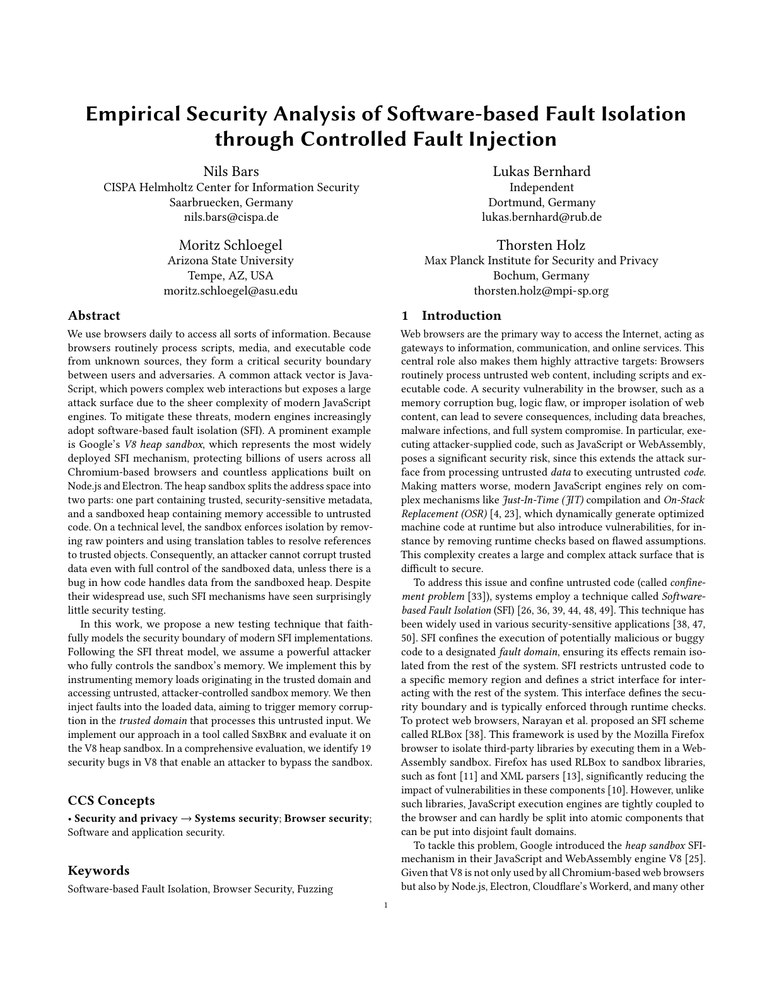

# SbxBrk

<a href="https://mschloegel.me/paper/bars2025sbxbrk.pdf"></a>

This repository contains an academic prototype that is capable of fuzzing the V8 heap sandbox.

> [!WARNING]
> Everything contained in this repository is intended to be used within the provided Docker environment.

> [!NOTE]
> The project was developed on Ubuntu 24.04 on an x86_64 CPU using Docker as an abstraction from the underlying system. Running it on non-Linux systems or on different hardware platforms may not work as intended!

<br clear="right"/>

# Setup
The section describes all steps to set up the fuzzer. First, the Docker runtime environment must be built, followed by building the fuzzer and the target V8. Ensure that you follow this section top-down, as some components depend on others.

## Building the Runtime Environment
Before preparing the runtime environment, this repository and all sub-repositories must be cloned:
```
git clone --recurse-submodules https://github.com/SbxBrk/SbxBrk.git
```

> [!TIP]
> If you prefer using SSH for push access, you can configure git to rewrite HTTPS URLs to SSH locally:
> ```
> git config --local url."git@github.com:".insteadOf "https://github.com/"
> ```

After cloning is finished, the environment can be built by executing `./env/build.sh`. This process will take some time. After it completes, you can use the `./env/start.sh` script to spawn the environment. See below for further details on the runtime's life cycle.

> [!NOTE]
> This is not required if downloaded from Zenodo.

### Managing the Runtime Environment Lifecycle
After building or pulling a pre-built version of the runtime environment, the fuzzer is ready to use. The fuzzer's environment lifecycle is managed by a set of scripts located in the [`env`](./env/) folder.

| Script | Description |
|--|---|
| [`./env/start.sh`](./env/start.sh)  | Spawn a new container or spawn a shell into an already running container. |
| [`./env/stop.sh`](./env/stop.sh)  | This stops the container. Remember to call this after rebuilding the image. |

Using [`start.sh`](./env/start.sh), an arbitrary number of shells can be spawned in the container. Using Visual Studio Code's [Dev Containers](https://code.visualstudio.com/docs/devcontainers/containers) extension allows you to work conveniently inside the Docker container.

> [!NOTE]
> Within the container, the root folder (containing this README.md file) is mounted as `/work`.


## Building AFL++
First, AFL++ must be built since it is used to compile V8. Noteably, this custom AFL++ version was needed during development to add support for LLVM 21. Current releases likely already support this version; however, this custom version is still provided to ensure the reproducibility of the results of this artifact.
For building AFL++, run the commands below:
```sh
cd /work/AFLplusplus
make -j
```

This should print the following after termination:
```
Build Summary:
[+] afl-fuzz and supporting tools successfully built
[+] LLVM basic mode successfully built
[+] LLVM mode successfully built
```

## Building the Fuzzer
Use the following commands to build the fuzzer itself:
```sh
cd /work/fuzzer
cargo build --release
```

This should print the following when done:
```
Finished `release` profile [optimized + debuginfo] target(s) in 34.33s
```

## Building V8
Within the runtime environment, use the following commands to build the target V8. Ensure that you build the fuzzer and AFL++ first. Building V8 will take some time.
```sh
cd /work/v8-build
./build.sh
```

After the build finished, the V8 shell (named `d8`) is located at `/work/v8-build/out/fuzzing-build/d8`. Since the shell is linked against the fuzzer's runtime, the path to the shared object containing this runtime must be provided to run the shell. To test whether the shells work as intended, you may use the following commands:
```sh
# Make sure d8 finds the fuzzer's runtime.
export LD_LIBRARY_PATH=/work/fuzzer/target/release
/work/v8-build/out/fuzzing-build/d8
```

This should spawn the shell and produce output similar to the following (the line prefix was stripped):
```
[INFO] Running without a fuzzer attached.
[INFO] You may set the log level via LOG_LEVEL={trace, debug, info, warn, error}
[INFO] Allocating fake FuzzerIpc on heap
[INFO] Trying to load input from environment
[INFO] INPUT environment variable is not set
[INFO] Setting heap sandbox base to 0x79d200000000
[INFO] Setting heap sandbox size to 0x10000000000
```

## Building FuzzilliSbx
Building FuzzilliSbx is only needed for rerunning the evaluation of the paper. For building, run the following commands:
```sh
cd /work/FuzzilliSbx

# Build FuzzilliSbx
./build_fuzzilli.sh

# Build V8 for FuzzilliSbx
./build_v8.sh
```

To test whether FuzzilliSbx works as intended, you may use the provided `./fuzzilli_test_run.sh` script. This should start fuzzing and periodically print some fuzzing stats.


> [!NOTE]
> This is only required if you intend to reproduce the results presented in the paper. If you want to use Fuzzilli to fuzz the heap sandbox, you should use the upstream version that added support for fuzzing the heap sandbox after this paper was already accepted.


# Running the Fuzzer

## Prerequisites
Before running the fuzzer, the following sysctl settings must be configured on the **host** (containers share the host kernel):
```sh
echo core | sudo tee /proc/sys/kernel/core_pattern
echo 1 | sudo tee /proc/sys/kernel/shm_rmid_forced
```

Running the fuzzer is as simple as executing the command below:
```sh
/work/fuzzer/target/release/v8fuzz fuzz \
    --purge \
    --log-level info \
    --timeout 2000 \
    --work-dir test-run \
    --seed-dir /work/evaluation/js_files/bug_seed_files -- \
    /work/v8-build/out/fuzzing-build/d8 \
        --fuzzing --sandbox-fuzzing --single-threaded \
        --allow-natives-syntax --expose-gc
```

This will store the results in a directory named `test-run`.

Replaying inputs or crashes can be done using the following command:
```sh
export LD_LIBRARY_PATH=/work/fuzzer/target/release
INPUT=<path-to-.ron-file> /work/v8-build/out/fuzzing-build/d8 --fuzzing --sandbox-fuzzing \
 --single-threaded --allow-natives-syntax --expose-gc
```

# Reproduction of the Paper's Results
Please see [evaluation/README.md](https://github.com/SbxBrk/evaluation/blob/main/README.md) for detailed instructions. Ensure that you first build AFL++, SbxBrk (the fuzzer), V8, and FuzzilliSbx.